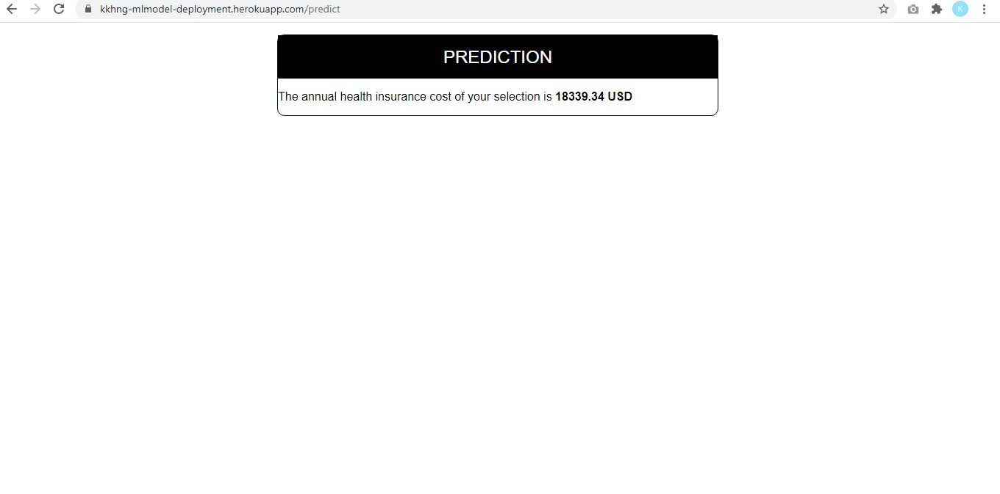

## Machine Learning Deployment 

### Predict The Annual Health Insurance Cost of US Resident
#### The dataset for this model prediction is from [Kaggle](https://www.kaggle.com/mirichoi0218/insurance).
#### This model has accuracy score of ~89% and it predicts using xgboost algorithm.
#### Welcome to test it :)
[https://safe-retreat-31240.herokuapp.com/](https://safe-retreat-31240.herokuapp.com/)

HomePage: 

ResultPage:

